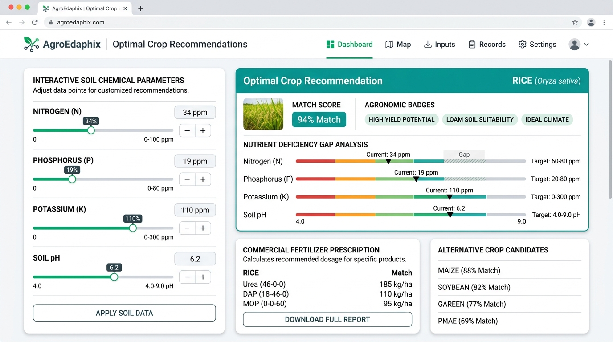
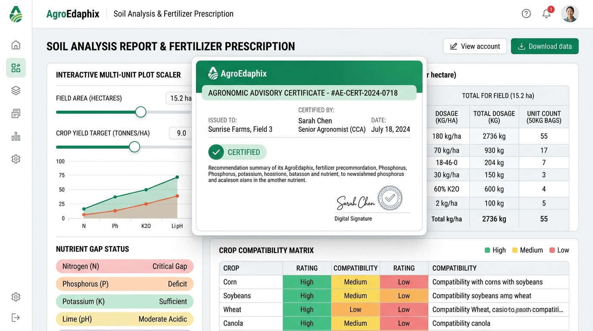

# 🌾 AgroEdaphix

**Precision Edaphic Soil Profiling & Agronomic Crop Compatibility Engine**

AgroEdaphix is an agritech intelligence platform that couples edaphic physicochemical modeling with machine learning algorithms to assess soil chemistry, recommend optimal crops, diagnose nutrient deficits, and synthesize precision commercial fertilizer prescriptions.

---

## 🖥️ Live Dashboard & Interface Preview

<div align="center">
  
  <p><em>AgroEdaphix Real-Time Dashboard: Interactive Soil Parameter Console, Optimal Crop Prediction, and Nutrient Gap Breakdown.</em></p>
</div>

---

## ⚡ Key Modules & Functional Overview

### 1. 🧪 Precision Soil Input Console
- **Dual-Control Adjustments**: Simultaneous range sliders and discrete numeric steppers for exact field test input.
- **One-Click Benchmark Soil Presets**:
  - *Alluvial Paddy Soil* (High N, Moderate P/K, Neutral pH)
  - *Black Cotton Loam* (High K, Alkaline pH)
  - *Red Laterite / Hill Soil* (Acidic pH, Low P, Low N)
  - *Degraded Sandy Soil* (Acute Nutrient Depletion)
  - *High-Fertility Organic Orchard* (Optimal NPK balance)
- **Real-Time Calculation Mode**: Toggle dynamic live calculation as sliders move or trigger on-demand recalculations.

### 2. 🌾 Crop Compatibility & Agronomic Suitability Engine
- **Multi-Vector Machine Learning Matching**: Compares user soil vectors against calibrated physiological profiles of 22 key food, grain, fruit, cash, and legume crops.
- **Suitability Scoring**: Instant percentage confidence rating based on weighted Euclidean distance across normalized nitrogen, phosphorus, potassium, and soil reaction envelopes.
- **Secondary Crop Candidates**: Displays ranked alternative candidates with comparative suitability metrics.

---

## 📊 Fertilizer Prescription & Agronomic Reporting

<div align="center">
  
  <p><em>Prescription Engine & Agronomic Report: Commercial Fertilizer Dosages, Field Scaling, and Laboratory Certificate.</em></p>
</div>

### 3. 💊 Commercial Fertilizer Dosage Synthesizer
- **Commercial Compound Conversion**:
  - **Urea** ($46\%\,\text{N}$) for nitrogen enrichment.
  - **Di-Ammonium Phosphate / DAP** ($18\text{-}46\text{-}0$) for phosphorus correction with nitrogen credit offset.
  - **Muriate of Potash / MOP** ($60\%\,\text{K}_2\text{O}$) for potassium deficits.
  - **Agricultural Limestone** ($\text{CaCO}_3$) for acid neutralizing ($\text{pH} < 6.0$) and **Agricultural Gypsum** for alkaline sodic conditioning ($\text{pH} > 7.8$).
- **Multi-Unit Plot Scaler**: Scale nutrient recommendations dynamically across **Hectares**, **Acres**, or **Square Meters** ($m^2$) with estimated 50 kg commercial bag counts.
- **Application Phasing**: Granular split-application guidance (Basal, Vegetative Tillering, and Panicle/Flowering stages).

### 4. 📜 Soil Test History & Print-Ready Laboratory Certificates
- **Record Management**: Persistent browser history tracking soil test iterations with one-click reload.
- **CSV Data Export**: Export field trial runs and soil assessments as structured CSV datasets.
- **Official Agronomic Soil Analysis Certificate**: Modal view featuring copy-to-clipboard summaries and print-to-PDF formatting for farmers, agronomists, and laboratory records.

---

## 🔬 Edaphic Parameters Matrix

| Parameter | Symbol | Unit | Test Range | Agronomic & Physiological Function |
|---|---|---|---|---|
| **Available Nitrogen** | $\text{N}$ | $\text{kg/ha}$ | $0 - 140$ | Vegetative growth, chlorophyll synthesis, tillering, and protein formation |
| **Available Phosphorus** | $\text{P}$ | $\text{kg/ha}$ | $5 - 145$ | Root elongation, early plant vigor, energy transfer (ATP), and fruit setting |
| **Available Potassium** | $\text{K}$ | $\text{kg/ha}$ | $5 - 205$ | Stomatal regulation, osmotic pressure, lodging resistance, and disease immunity |
| **Soil Reaction** | $\text{pH}$ | $-\log[\text{H}^+]$ | $3.5 - 9.5$ | Micronutrient solubility, microbial mineralization, and cation exchange capacity |

---

## 🛠️ Architecture & Tech Stack

- **UI & Application Framework**: React 18 with TypeScript
- **Styling & Design System**: Tailwind CSS v4 (Light-mode precision agritech theme)
- **Animations & Transitions**: Motion
- **Icons & Data Glyphs**: Lucide React
- **Build Engine**: Vite 6

---

## 🚀 Getting Started

### Prerequisites

- **Node.js** (v18+ recommended)
- **npm** or **bun**

### Local Installation & Setup

1. **Clone the repository**:
   ```bash
   git clone https://github.com/ahmedjawad24/soil_crop_predictor.git
   cd soil_crop_predictor
   ```

2. **Install project dependencies**:
   ```bash
   npm install
   ```

3. **Start the development server**:
   ```bash
   npm run dev
   ```

4. **Access the application**:
   Open [http://localhost:3000](http://localhost:3000) in your browser.

### Production Build

```bash
npm run build
```

---

## 📄 License

MIT License
